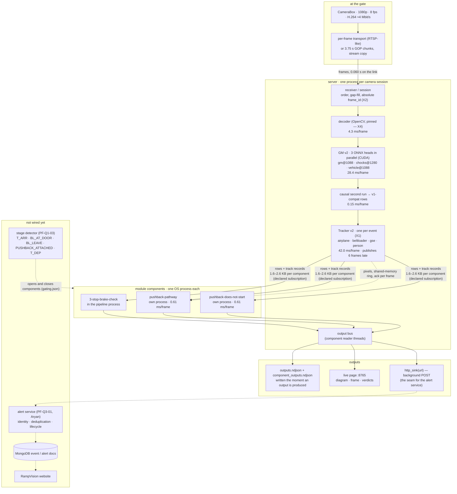
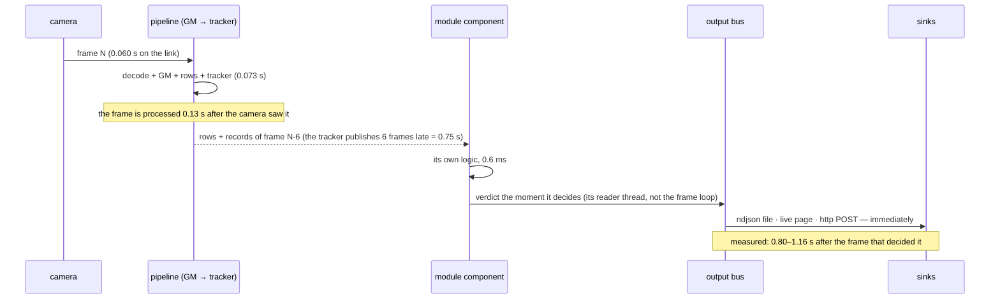

# The real-time branch as it runs today

Everything below is what the code does now, with the cost measured on one run: `slice_comp2` — the decision slice of
event zHxIAF2vUGxJ (5 048 frames, 10.5 min), per-frame ingest at 10 Mbit/s, real-time speed, three GM heads, the full
tracker and three production modules on a quiet machine. Nothing here is a plan; the plan parts are marked *not wired*.

## 1. What runs



## 2. What each stage adds, and what it costs

| stage | what it does | what it adds to the frame record | measured |
|---|---|---|---|
| transport | per frame as soon as it is encoded, or 3.75 s GOP chunks | — | link 0.060 s p50 at 10 Mbit/s; a chunk instead costs 1.94 s of waiting |
| receiver | orders arrivals, fills a lost chunk with placeholder frames, keeps the absolute `frame_id` | `frame_id`, `capture_t`, `placeholder` | 0.008 s queue |
| decoder | one pinned decoder, frame count checked against the manifest | `image` (BGR, by reference) | 4.3 ms |
| GM v2 | three heads in parallel: gm 15.0 ms inference + 7.2 post, chocks 14.9 + 5.0, vehicle; upload 1.1 ms | `general_model`: `[x1,y1,x2,y2,conf,cls_id]` | 28.4 ms |
| causal second run | the v1 second-run pass done causally (`pf/pipeline/causal_rows.py`) | obstacle / side-obstacle / aircraft rows | 0.15 ms |
| Tracker v2 | one tracker per event, DeepSORT ×3 + optical flow + segmentors | `trackers`: `{tr_id, cls_str, xyxy, conf, state_dict}` | 42.0 ms |
| components | each module in its own process, given only its declared subscription | — | 0.61 ms each; hand-off 0.174 ms per frame for both |
| **total** | | | **73.3 ms of the 125 ms budget** (64.6 ms in the run without subscriptions) |

## 3. How an output arrives



The 0.13 s is the frame; the rest is the tracker's publication delay (0.75 s — the worker DeepSORT `N_INIT: 6`, kept for
parity) plus the module's own time. Shortening it is `TrackerOptions.publish_delay`, gated by verdict parity (PF-Q1-17).

## 4. The outputs themselves

Every output is one record — `Output(kind, name, frame_id, payload, emitted_t)` — carrying the **absolute** frame id it
refers to, even for a component whose own session started later.

| kind | when | who produces it today |
|---|---|---|
| `verdict` | the module's own logic decided | all three modules (Pass / Fail / Not observed + report + smart timeline) |
| `alert` | a client rule is met while the session runs | hooks (`pf/rt/hooks/vests.py` for vest status); the other modules answer once |
| `event` | something the branch itself noticed (component opened / closed) | the component shell |
| `note` | audit: non-causal reads, look-back misses, module errors, the run's own report | the module shell and the pipeline |

Where they go **today**: `out/rt/runs/<tag>/outputs.ndjson` (the run's record), `component_outputs.ndjson` (written the
instant a component produces one) and the live page on `:8765`.

Where they go **next**: `http_sink(url)` POSTs each record as JSON from a background thread — that is the interface the
alert service (PF-Q3-01) consumes; from there identity, deduplication and lifecycle, then the MongoDB event/alert docs and
RampVision, exactly as ADR-004 describes. Nothing in the branch waits for that POST: a stalled endpoint drops records into
a counter, never into the frame path.

## 5. What is deliberately not there yet

- **Stage detector** (PF-Q1-03): the gates in `pf/rt/gating.json` are written and reported in every run, but nothing
  publishes `T_ARR` / `BL_LEAVE` / `PUSHBACK_ATTACHED` yet, so every component runs from the first frame.
- **The alert service** (PF-Q3-01): the sink exists, the endpoint does not.
- **The second camera**: one session = one camera. The wing camera is a second instance of exactly this, not a change.
- **The other modules**: 3 of the 11 real-time candidates run; the pixel ones (safety-vests, wing-walkers) need the
  shared-memory ring path exercised on a real run, which the component layer now supports.

## 6. How to run it

```bash
python scripts/rt_watch.py --video <event or slice>.mp4 \
    --module 3-stop-brake-check \
    --extra-modules pushback-pathway-confirmed-clear-of-obstacles,pushback-does-not-start-until-wing-walkers-are-in-place-and-ready \
    --ingest frames --bandwidth-mbps 10 --pause-testset
```

`scripts/rt_slices.py` cuts an event down to the minutes where the modules decide; `scripts/rt_components.py` prints the
component table; `docs/10_ci.md` says what is tested where.
