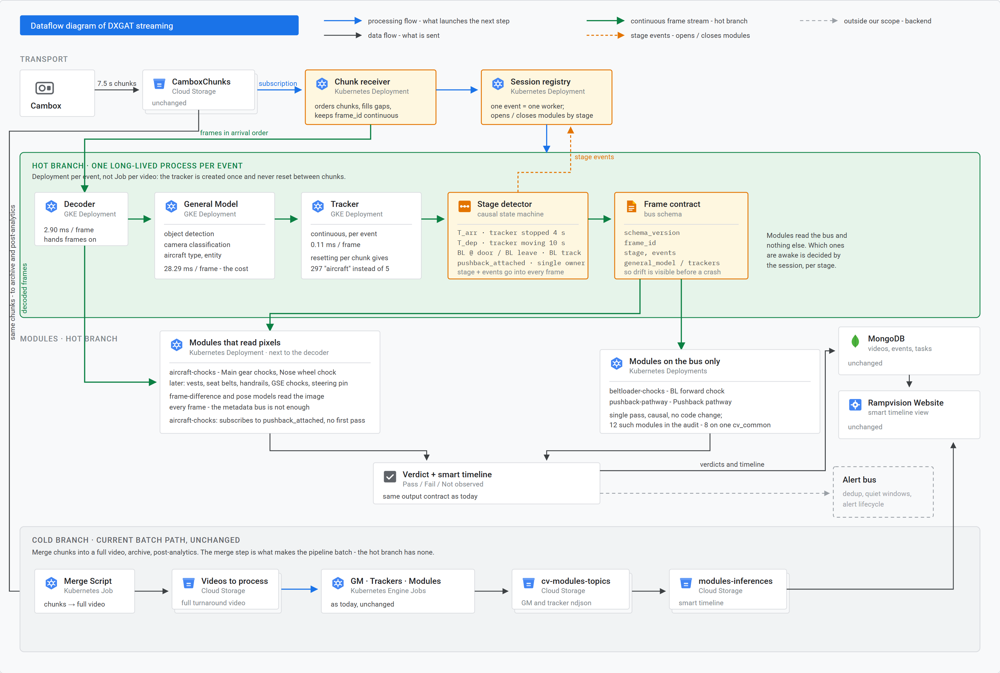
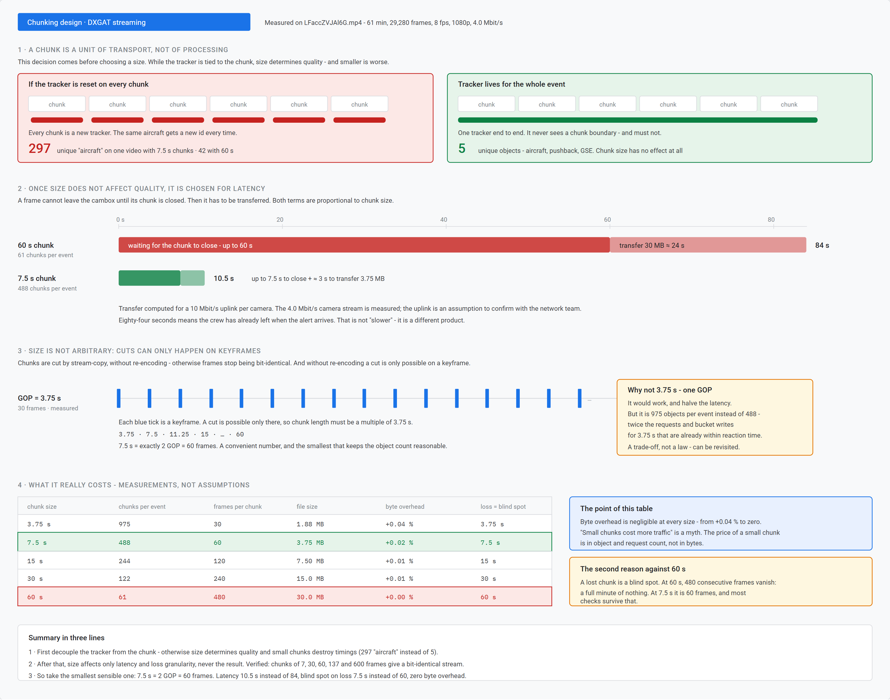

_English translation of `G:/gat-streaming/docs/architecture.md` (Ukrainian original), 2026-09-14._

# Architecture

## One ingest, two branches



The camera hands over the stream once. From there it forks: the hot branch computes
what has to be answered now, the cold branch — what can wait until the end of the turnaround.

```
cambox ──► 7.5 s chunks ──► GM + tracker ──┬──► hot branch: 4 checks ──► verdict
 1080p     stream-copy      one per event  │
 8 fps     no re-encode                    └──► cold: post-analytics on the full recording
 ≈4 Mbit/s
```

A chunk is a unit of **transport**, not a unit of processing. The module does not know
about chunks and must not.

Why exactly 7.5 s and not 60 — a separate breakdown with measurements: 

## The rule everything rests on

**The tracker is created once per turnaround and is never reset.**

This is not an optimization, it is a correctness condition. Measured on real video, the
same input, the only difference is how the tracker lives:

| tracker mode | unique "aircraft" | consequence |
|---|---|---|
| end-to-end, no reset | **5** | normal — aircraft, pushback, equipment |
| reset every 60 s | 42 | timings fall apart |
| reset every 7.5 s | 297 | no check works at all |

## Four correctness conditions

These are not recommendations. Violating any of them means the streaming result
stops matching the current end-to-end one.

**X1. The tracker lives for the whole turnaround.** See the table above.

**X2. Frame numbering is end-to-end and explicit.** Modules take the frame number from
`enumerate(metadata, 1)`, i.e. **from the position in the stream**. As long as the stream is
intact, this works. As soon as a chunk is lost, the position stops matching the absolute id,
and comparisons like `frame_number == aircraft.departure_frame` point at the wrong
frame. That is why the contract has the mandatory field `frame_id`, and the receiver fills
the gaps with placeholder frames instead of simply skipping frames.

**X3. The schema has a version.** `schema_version` in every record. Without it an
incompatible input is discovered only by the module crashing — that is exactly how we lost a day.

**X4. The decoder is pinned on both sides of the comparison.** The first full parity
test showed 22 791 frames versus 22 800 and looked like a failure. In reality ffmpeg and
OpenCV were being compared: the merged production videos occasionally have non-monotonic
DTS, ffmpeg drops frames on it, OpenCV reads all of them. If the decoder is not
pinned — you measure the difference between libraries, not between architectures.

## Five components that do not exist today

| component | state | what it does |
|---|---|---|
| chunk receiver | missing | receives, orders, fills the gaps |
| session registry | modelled in `session.py` | one turnaround = one tracker = one set of states |
| schema contract | present in `contract.py` | `schema_version`, `frame_id`, field-leakage check |
| alert bus | **not here** | deduplication, silence windows — the backend's job |
| VPN tunnel | missing | transport cambox → server, ≈4 Mbit/s per camera |

In the code, `db_worker.ML_worker.load_source` has
`raise Exception("Stream is not implemented yet")` for rtsp/http — stream ingest really is
absent from their code, this is not an assumption.

## Frame budget

At 8 fps there are 125 ms per frame. Measured on an RTX 5070 Ti, core profile:

| component | ms/frame |
|---|---|
| decode | 2.90 |
| detection | 28.29 |
| tracker | 0.11 |
| module logic (simplified) | 0.03 |

The whole real-time problem boils down to the detector and its plumbing. Tracker and logic
together — 0.14 ms against 125.

**Caveat.** Those 0.03 ms come from simplified logic. The real
`aircraft-chocks` runs effnetb0 inference every frame for each rear
wheel, and its cost is two orders of magnitude higher. It still fits in the budget,
but the order of magnitude must be stated honestly.
